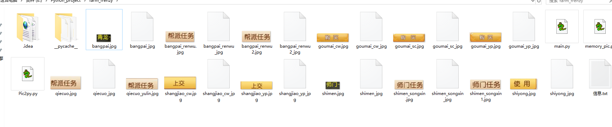
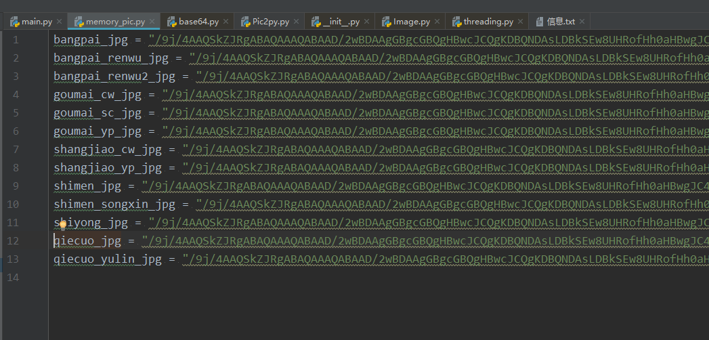
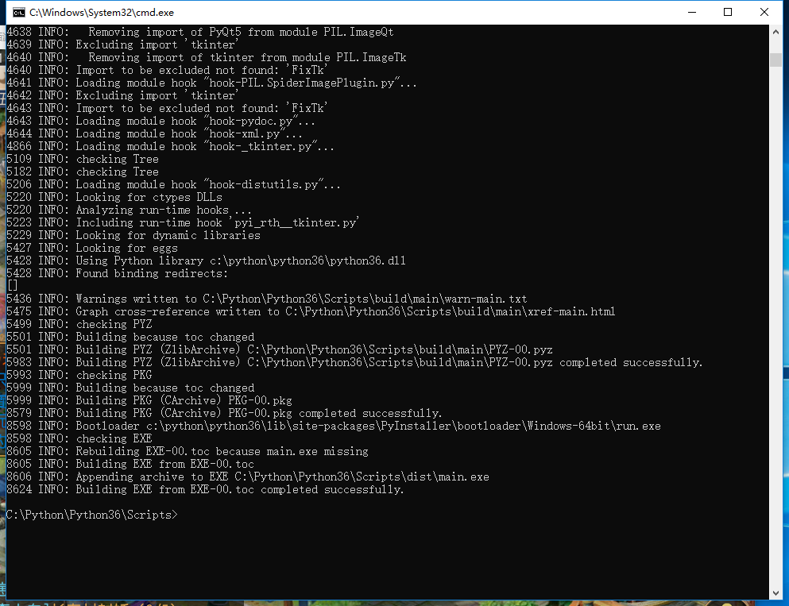
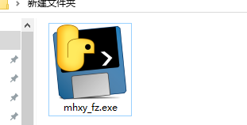
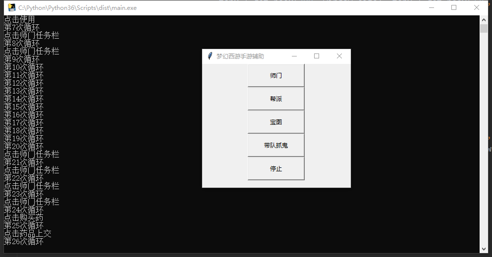

# mhxy_fz

一个基于计算机视觉开发的梦幻西游辅助脚本

（为了不让别有用心的人用软件牟利，虽然软件打包好了，但仅供有兴趣的人学习代码，不提供软件下载）

从有想法到弄出来花了两三天，很多知识都是现学的，哈哈，虽然有点累，但是蛮开心的。

【注】本工具不为盈利，只为兴趣，学以致用而已。

麻烦觉得不错的人点个star哦！

【注1】脚本或程序需要跑在管理员权限运行才行。因为鼠标点击需要管理员权限。只截图不需要。

【注2】本项目代码完整，文中只是展示了一部分。

【注3】类似下面的资源图片不会提供哦。

我的代码力都有截图保存的部分被我注释了，想实践的同学可以根据自己的窗口的情况先在目标区域截图保存作为基准，然后以后每次运行都截图来和保存的图比较即可。



本教程分四部分：

（1）使用python 的pywin32这个库来实现对Windows窗口的操作和点击。

（2）使用PIL来实现图像相似度的计算。

（3）使用tkinter这个库来实现图形化界面。

（4）使用pyinstaller这个库来实现把源程序打包成.exe文件。

## 一、pywin32的主要作用

1.捕获窗口；

```python
def resolution():  # 获取屏幕分辨率
    return win32api.GetSystemMetrics(0), win32api.GetSystemMetrics(1)

# 获取梦幻西游窗口信息，返回一个矩形窗口
def get_window_info():
    wdname = u'《梦幻西游》手游'
    handle = win32gui.FindWindow(0, wdname)  # 获取窗口句柄
    if handle == 0:
        return None
    else:
        return win32gui.GetWindowRect(handle)
```

2.模拟鼠标键盘动作；

```python
def move_click(x, y, t=0):  # 移动鼠标并点击左键
    win32api.SetCursorPos((x, y))  # 设置鼠标位置(x, y)
    win32api.mouse_event(win32con.MOUSEEVENTF_LEFTDOWN |
                         win32con.MOUSEEVENTF_LEFTUP, x, y, 0, 0)  # 点击鼠标左键
    if t == 0:
        time.sleep(random.random()*2+1)  # sleep一下
    else:
        time.sleep(t)
    return 0
```

## 二、使用PIL来抓取图像并实现相似度计算

```python
#师门任务
def shimen(window_size):
    global is_start
    is_start = True
    topx, topy = window_size[0], window_size[1]
    # 使用按钮（比如是x1,y1,x2,y2）
    shiyong = Image.open("shiyong_jpg")
    shiyong_hash = get_hash(shiyong)
    # shiyong.show()
    # print(shiyong_hash)
    # 购买宠物（比如是x1,y1,x2,y2）
    goumai_cw = Image.open("goumai_cw_jpg")
    goumai_cw_hash = get_hash(goumai_cw)
    # 上交药品按钮（比如是x1,y1,x2,y2）
    shangjiao_yp = Image.open("shangjiao_yp_jpg")
    shangjiao_yp_hash = get_hash(shangjiao_yp)
    # 上交宠物按钮
    shangjiao_cw = Image.open("shangjiao_cw_jpg")
    shangjiao_cw_hash = get_hash(shangjiao_cw)
    #师门任务栏
    shimen = Image.open("shimen_jpg")
    shimen_hash = get_hash(shimen)

    # 师门任务栏
    shimen_songxin = Image.open("shimen_songxin_jpg")
    shimen_songxin_hash = get_hash(shimen_songxin)

    # 药店购买
    goumai_yp = Image.open("goumai_yp_jpg")
    goumai_yp_hash = get_hash(goumai_yp)
    # 商城购买
    goumai_sc = Image.open("goumai_sc_jpg")
    goumai_sc_hash = get_hash(goumai_sc)
    i=0
    count = 0
    while is_start:
        time.sleep(2)
        i=i+1
        print("第%i次循环" %i)
        # 使用按钮（635 ，510 ，710 ，540）
        img_shiyong = ImageGrab.grab((topx + get_posx(635, window_size), topy + get_posy(510, window_size), topx + get_posx(710, window_size), topy + get_posy(540, window_size)))
        # img_shiyong.show()
        # img_shiyong.save("shiyong.jpg")
        # print("显示图片")
        # print(get_hash(img_shiyong))
        # print(hamming(get_hash(img_shiyong), shiyong_hash, 20))
        if hamming(get_hash(img_shiyong), shiyong_hash, 20):
            move_click(topx + get_posx(670, window_size), topy + get_posy(525, window_size))
            print("点击使用")
            time.sleep(3)
            continue

        # 购买宠物610，505，740，540
        img_goumai_cw = ImageGrab.grab((topx + get_posx(610, window_size), topy + get_posy(505, window_size),  topx + get_posx(740, window_size), topy + get_posy(540, window_size)))
        # img_goumai_cw.save("goumai_cw.jpg")
        if hamming(get_hash(img_goumai_cw), goumai_cw_hash, 20):
            move_click(topx +get_posx(680, window_size), topy + get_posy(520, window_size))
            print("点击购买宠物")
            time.sleep(3)
            continue

        # 药店购买 570，470，700，505
        img_goumai_yp = ImageGrab.grab((topx + get_posx(560, window_size), topy + get_posy(460, window_size), topx + get_posx(690, window_size), topy + get_posy(500, window_size)))
        # img_goumai_yp.save("goumai_yp.jpg")
        if hamming(get_hash(img_goumai_yp), goumai_yp_hash, 20):
            move_click(topx + get_posx(620, window_size), topy + get_posy(480, window_size))
            print("点击购买药")
            time.sleep(3)
            continue

        # 商城购买 520，520，715，550
        img_goumai_sc = ImageGrab.grab((topx + get_posx(580, window_size), topy + get_posy(515, window_size), topx + get_posx(715, window_size), topy + get_posy(550, window_size)))
        # img_goumai_sc.save("goumai_sc.jpg")
        if hamming(get_hash(img_goumai_sc), goumai_sc_hash, 20):
            move_click(topx + get_posx(650, window_size), topy + get_posy(530, window_size))
            print("点击商城购买")
            time.sleep(3)
            continue

        # 上交药品按钮 600，470，700，500
        img_shangjiao_yp = ImageGrab.grab((topx + get_posx(590, window_size), topy + get_posy(465, window_size), topx + get_posx(695, window_size), topy + get_posy(490, window_size)))
        # img_shangjiao_yp .save("shangjiao_yp.jpg")
        if hamming(get_hash(img_shangjiao_yp), shangjiao_yp_hash, 20):
            move_click(topx + get_posx(640, window_size), topy + get_posy(478, window_size))
            print("点击药品上交")
            time.sleep(3)
            continue

        # 上交宠物按钮
        img_shangjiao_cw = ImageGrab.grab((topx + get_posx(500, window_size), topy + get_posy(460, window_size), topx + get_posx(600, window_size), topy + get_posy(500, window_size)))
        # img_shangjiao_cw.save("shangjiao_cw.jpg")
        if hamming(get_hash(img_shangjiao_cw), shangjiao_cw_hash, 20):
            move_click(topx + get_posx(550, window_size), topy + get_posy(480, window_size))
            print("点击宠物上交")
            time.sleep(3)
            continue

        # 师门任务按钮
        img_shimen_songxin = ImageGrab.grab((topx + get_posx(620, window_size), topy + get_posy(345, window_size), topx + get_posx(700, window_size), topy + get_posy(370, window_size)))
        # img_shimen_songxin .save("shimen_songxin1.jpg")
        if hamming(get_hash(img_shimen_songxin), shimen_songxin_hash, 30):
            move_click(topx + get_posx(660, window_size), topy + get_posy(360, window_size))
            print("点击师门任务")
            time.sleep(3)
            continue

        # # 师门任务栏 630，150，665，175
        img_shimen = ImageGrab.grab((topx + get_posx(630, window_size), topy + get_posy(160, window_size), topx + get_posx(670, window_size), topy + get_posy(180, window_size)))
        # img_shimen.save("shimen.jpg")
        if hamming(get_hash(img_shimen), shimen_hash, 40):
            move_click(topx + get_posx(650, window_size), topy + get_posy(170, window_size))
            print("点击师门任务栏")
            time.sleep(3)
            continue
```

具体思路就是抓取对应位置的图像和已经保存的图像进行相似度计算，（这里使用的是计算汉明距离，值越小说明越相似。）如果出现相似的情况就说明事件发生，然后点击按钮。否则什么也不做。这样就避免了传统的定时定点点击的弊端。我们的脚本可以每次都点击，也可以很多次不点。经测试，效果很好。就和人一样只有在需要点击的时候才会点击。平时什么也不做。

## 三、tkinter图像化界面

```python
# 启动
if __name__ == "__main__":
    screen_resolution = resolution()
    # print(screen_resolution)
    window_size = get_window_info()
    print(window_size)
    global is_start

    # 创建主窗口
    root = tk.Tk()
    root.title("梦幻西游手游辅助")
    root.minsize(300, 250)
    root.maxsize(300, 250)
    # 创建按钮
    button_shimen = tk.Button(root, text=u"师门", command=lambda: MyThread(shimen, window_size), width = 15,height = 2)
    button_shimen.place(relx=0.2, rely=0.15, width=200)
    button_shimen.pack()

    button_bangpai = tk.Button(root, text="帮派", command=lambda: MyThread(bang_pai, window_size), width = 15,height = 2)
    button_bangpai.place(relx=0.2, rely=0.35, width=200)
    button_bangpai.pack()

    button_baotu = tk.Button(root, text="宝图", command=lambda: MyThread(baotu,window_size), width = 15,height = 2)
    button_baotu.place(relx=0.4, rely=0.55, width=200)
    button_baotu.pack()

    button_zhuagui = tk.Button(root, text="带队抓鬼", command=lambda: MyThread(zhua_gui, window_size), width = 15,height = 2)
    button_zhuagui.place(relx=0.4, rely=0.65, width=100)
    button_zhuagui.pack()

    button_tingzhi = tk.Button(root,text=u"停止", command=lambda: MyThread(stop), width = 15,height = 2)
    button_tingzhi.place(relx=0.4, rely=0.85, width=200)
    button_tingzhi.pack()

    root.mainloop()
```

结果展示：


## 四、pyinstaller 打包

直接使用pyinstaller打包的话，如图片之类的资源文件并不会被打包。所以把图片需要转化成.py文件。在需要的地方导入才能使用。（当然也有其他方法，我使用的是这个）

【注】这段代码来源于CSDN

```python
#!/usr/bin/env python
# _*_ coding:utf-8 _*_

import base64


def pic2py(picture_names, py_name):
    """
    将图像文件转换为py文件
    :param picture_name:
    :return:
    """
    write_data = []
    for picture_name in picture_names:
        filename = picture_name.replace('.', '_')
        open_pic = open("%s" % picture_name, 'rb')
        b64str = base64.b64encode(open_pic.read())
        open_pic.close()
        # 注意这边b64str一定要加上.decode()
        write_data.append('%s = "%s"\n' % (filename, b64str.decode()))

    f = open('%s.py' % py_name, 'w+')
    for data in write_data:
        f.write(data)
    f.close()


if __name__ == '__main__':
    pics = ["bangpai.jpg", "bangpai_renwu.jpg", "bangpai_renwu2.jpg", "goumai_cw.jpg","goumai_sc.jpg","goumai_yp.jpg","shangjiao_cw.jpg"
            ,"shangjiao_yp.jpg","shimen.jpg","shimen_songxin.jpg","shiyong.jpg","qiecuo.jpg", "qiecuo_yulin.jpg"]
    pic2py(pics, 'memory_pic')  # 将pics里面的图片写到 memory_pic.py 中
    print("ok")
```

结果是这样



使用：

在需要使用的地方导入，就可以把bangpai_jpg当作bangpai.jpg来使用。

（不懂的同学可以百度一下或者CSDN一下base64编解码哈。）

```python
import base64

# 从.py文件获取图片
def get_pic(pic_code, pic_name):
    image = open(pic_name, 'wb')
    image.write(base64.b64decode(pic_code))
    image.close()
# 导入图片
get_pic(bangpai_jpg, 'bangpai_jpg')
get_pic(bangpai_renwu_jpg, 'bangpai_renwu_jpg')
get_pic(bangpai_renwu2_jpg, 'bangpai_renwu2_jpg')
get_pic(goumai_cw_jpg, 'goumai_cw_jpg')
get_pic(goumai_sc_jpg, 'goumai_sc_jpg')
get_pic(goumai_yp_jpg, 'goumai_yp_jpg')
get_pic(shangjiao_cw_jpg, 'shangjiao_cw_jpg')
get_pic(shangjiao_yp_jpg, 'shangjiao_yp_jpg')
get_pic(shimen_jpg, 'shimen_jpg')
get_pic(shimen_songxin_jpg, 'shimen_songxin_jpg')
get_pic(shiyong_jpg, 'shiyong_jpg')
```

结果展示：

打包成功！






运行结果以及日志。



经测试，打宝图，师门任务，帮派任务全做完了，

在本电脑上测试，效果很好，所有情况都检测到了，但是换了一台比较旧的电脑屏幕，偶尔就会有一个按钮检测不出来，这时候就需要调整参数或者在本机上抓取图片来作为基准（因为我们是从屏幕截图和我们保存的图的相似度来判断事件是否发生的，所以屏幕是有关系的比较老的屏幕一般看起来比较暗，所以偶尔检测不出来也是正常）。

抓鬼的话没具体做，只是把代码写好了没有填具体参数所以没有功能。因为觉得组好队只需要跟着别人就好了。10次才需要点击一次继续按钮。不需要做。当然如果有兴趣的同学可以把我的这部分代码补充完整，然后就可以使用啦。

【注】脚本或程序需要跑在管理员权限运行才行。因为鼠标点击需要管理员权限。只是截图不需要。